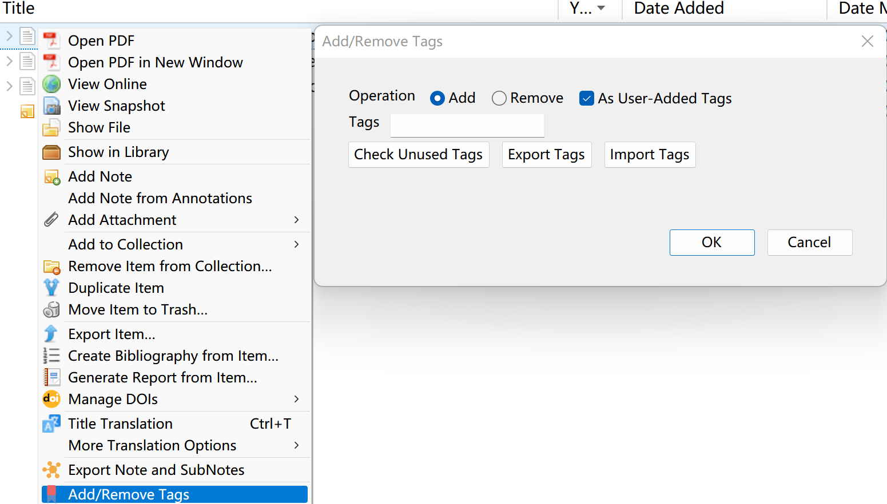
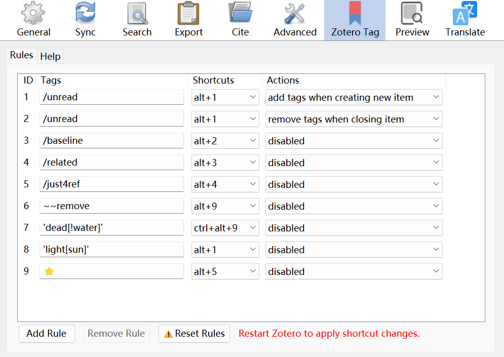
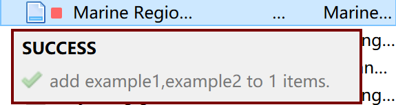
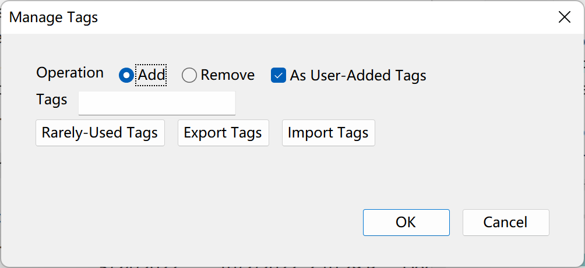

# Zotero Tag

_One add-on to rule Tags all._  
Manage all your Tags in one [Zotero](https://www.zotero.org/) add-on.

- Automatically add `/unread` tag for new items and remove `/unread` after read
- Support batch processing with tags
- Manage tags with custom rules
- Export tags to CSV file
- Import tags from CSV file

# Quick Start Guide

## Install

- Download the latest release (.xpi file) from the [Releases Page](https://github.com/windingwind/zotero-tag/releases)  
  _Note_ If you're using Firefox as your browser, right click the xpi and select "Save As.."
- In Zotero click "Tools" in the top menu bar and then click "Addons"
- Go to the Extensions page and then click the gear icon in the top right.
- Select Install Add-on from file.
- Browse to where you downloaded the .xpi file and select it.
- Restart Zotero, by clicking "restart now" in the extensions list where the plugin is now listed.

## Usage

Once you have the plugin installed simply, right click any item in your collections to add/remove tags in batch.



Auto-tag settings can be found in the Preference menu.

## Settings

### Tag Rules

Use rules to control your tag strategies: Menu->Edit->Preferences->Zotero Tag->Rules

Assign tag groups to different events: item add/open/close...;

Split tags by ','(comma) and manage them in one rule; use prefix '~~' for tags to remove;

**Example:**
tag newly added items `/unread` and remove the unread tags when you close the item's attachments:

| tags    | action                          |
| ------- | ------------------------------- |
| /unread | add tags when creating new item |
| /unread | remove tags when closing item   |

**Example:**
use prefix `~~` for tag to remove.

- `~~remove`

**Example:**
conditionally add/remove tags, depending on an existing tag.

- `'dead[!water]'` if tag `water` does not exists, add/remove tag `dead`.
- `'light[sun]'` if tag `sun` exists, add/remove tag `light`.



### Shortcut Keys

Alt+(1-9) for adding/removing tags



### Colorize Tags for Better Experience

[Colorize Guide](./docs/tag-color.md)

### Rate Items with Stars

[Setting Guide](./docs/item-star.md)


### Manage Tags Manually

- Right-click on items/collection/library
- Click 'Manage Tags'



**Add/Remove Tags**

Enter tags (split by `,`) and press OK.

**Check Rarely-Used Tags**

Click 'Rarely-Used Tags' and enter the threshold $N$. Tags in selected collection will be counted and those used less than $N$ times will be put into the input box and your clipboard.

**Export Tags**

Click 'Export Tags'. If you want to also export all tags in sub-collections, please check 'Include Sub-Collections'.

The CSV file columns are: tag, count, item name, item id.

**Import Tags**

Import tags from CSV file and apply them to all items in current collection/library.

The CSV file columns must be:

- Mode (`+` for add, `-` for remove, and `=` for replace)
- Target tag.
- Matched tags, split with `,`. If one item has one of these tags, the target tag will be added to it (add mode)/be removed from it (remove mode)/replace the matched tags (replace mode) accordingly. If matched tags is empty, then all items will be matched.

Do not need a heading line.

Example CSV file content:

```csv
+,/unread,/new
-,toremove,
=,BIM,building information modeling,Building Information Modeling (BIM)
=,this is comma($COMMA$),$COMMA$
```

Explanation for Each Line:

1. Items with tag `/new` will be tagged `/ unread`
2. All items will be untagged `toremove`.
3. The `building information modeling` and `Building Information Modeling (BIM)` tags will be replaced by `BIM`.
4. The `,` tag will be replaced by `this is comma(,)`. Commas in tags should be replaced by `$COMMA$` in the input CSV file.

## Building

This addon is created based on the [Zotero addon template](https://github.com/windingwind/zotero-pdf-translate#development).

```shell
git@github.com:windingwind/zotero-tag.git
cd zotero-tag
npm install
# Only build a .xpi
npm run build
# Release to github
npm run release
```

## Disclaimer

Use this code under AGPL License. No warranties are provided. Keep the laws of your
locality in mind!

Part of the code of this repo refers to other open-source projects within the allowed scope.

- zotero-scihub
- Jusminum

## My Other Zotero Add-ons

- [zotero-pdf-preview](https://github.com/windingwind/zotero-pdf-preview): PDF preview for Zotero
- [zotero-better-notes](https://github.com/windingwind/zotero-better-notes): Everything about note management. All in Zotero.
- [Zotero-pdf-translate](https://github.com/windingwind/zotero-pdf-translate/): PDF translation add-on for Zotero 6
